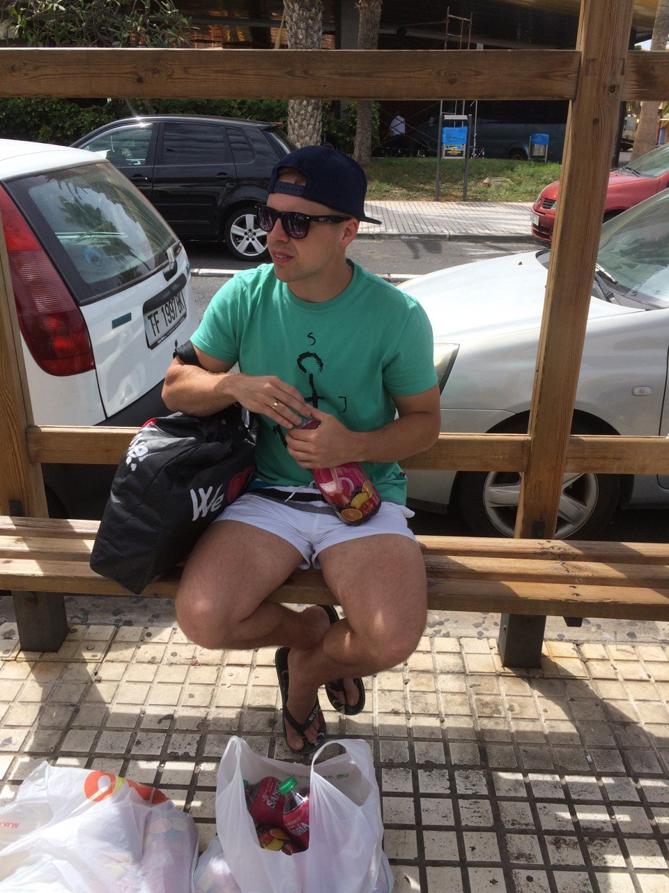

# RESUME

## Gleb Zavalov

> +375296180501
> oldg590@gmail.com
> telegram: @oldg590

### Summary about me

Communicative, responsible. I want to learn JavaScript and different frameworks and NodeJS for improve my skills and be able to write cool applications that will be useful to people. My English level is Pre-Intermediate. When I have free time I study English with youtube and use applications, also additional materials on programming.

### Skills

Familiar with methodology of Scrum and Agile. Have Soft Skills, working with team.

### Experience

Coding tests, some projects from courses, write app in React Native.

### Education

Online courses:

- Webpack
- Git
- React
- React Native
- JavaScript
- NodeJS
- TypeScript
- Koa
- Express
- PWA

Design:

- Figma
- AdobeXD

Other:

- meetups
- lectures
